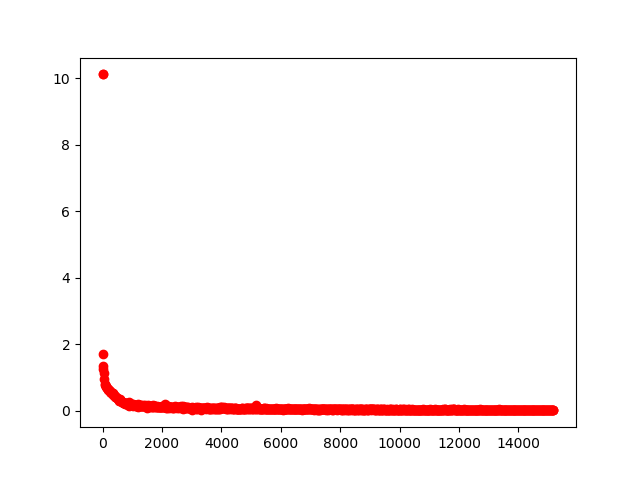

# Semantic Segmentation
### Introduction
In this project, you'll label the pixels of a road in images using a Fully Convolutional Network (FCN).

### Training
I followed the walktrhough for this project: a pre-trained VGG-16 network converted to a fully convolutional network with a 1x1 convolution and skipping the connections on layers 3 and 4.

For the loss function I used a cross entropy and Adam as optimizer.

For the training and the results shown here the next parameters were used:

- Keep probability: 0.5
- Epochs 50
- Batch size 16
- learning rate 0.001

To change these parameters, run the script

```
$ python main.py  EPOCHS  BATCH_SIZE  KEEP_PROB
```

### Results


In the next figure we can see the loss value over the samples trained



After 50 epochs the value is 0.016465. 
In the file `loss_value.txt` are the loss values for everyt batch run.


Here we can see some images from the output:


-----

__Below this line is the original content from the readme file__

### Setup
##### Frameworks and Packages
Make sure you have the following is installed:
 - [Python 3](https://www.python.org/)
 - [TensorFlow](https://www.tensorflow.org/)
 - [NumPy](http://www.numpy.org/)
 - [SciPy](https://www.scipy.org/)
##### Dataset
Download the [Kitti Road dataset](http://www.cvlibs.net/datasets/kitti/eval_road.php) from [here](http://www.cvlibs.net/download.php?file=data_road.zip).  Extract the dataset in the `data` folder.  This will create the folder `data_road` with all the training a test images.

### Start
##### Implement
Implement the code in the `main.py` module indicated by the "TODO" comments.
The comments indicated with "OPTIONAL" tag are not required to complete.
##### Run
Run the following command to run the project:
```
python main.py
```
**Note** If running this in Jupyter Notebook system messages, such as those regarding test status, may appear in the terminal rather than the notebook.

### Submission
1. Ensure you've passed all the unit tests.
2. Ensure you pass all points on [the rubric](https://review.udacity.com/#!/rubrics/989/view).
3. Submit the following in a zip file.
 - `helper.py`
 - `main.py`
 - `project_tests.py`
 - Newest inference images from `runs` folder  (**all images from the most recent run**)
 
 ## How to write a README
A well written README file can enhance your project and portfolio.  Develop your abilities to create professional README files by completing [this free course](https://www.udacity.com/course/writing-readmes--ud777).
